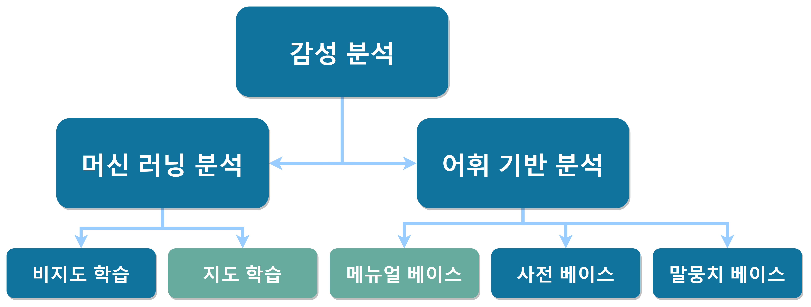

# ANT_MIND

## 네이버 종목토론실 댓글 감성(공포/탐욕) 분석

## 0. 목차 

1. 개요 및 플로우 차트
   - 개요
   - 플로우차트
2. 굿

## 1. 개요 및 플로우 차트

- #### 개요
  

   감성분석은 크게 두가지로 분류될 수 있다. 첫번째는 어휘 기반 분석, 두번째는 머신 러닝 분석이다.  이번 프로젝트에서 사용하는 비정형 데이터인 네이버 금융 종목토론실 댓글의 감정(공포/탐욕) 분석을 진행할 예정이다.하지만 이러한 데이터에는 현재 공포/탐욕 레이블링이 되어있는 학습데이터가 존재하지 않다. 그렇기 때문에 머신 러닝 분석에서 비지도 학습을 진행하거나, 어휘 기반 분석을 진행해야만 한다. 나는 지도 학습으로 분석을 하고 싶기 때문에, 내가 직접 공포/탐욕 단어 메뉴얼을 만들어서 어휘 기반 분석을 진행해서 학습데이터를 생성한 뒤, 그 데이터로 지도 학습을 진행할 계획이다. 지도학습은 최근 성능이 좋다고 유명한 BERT모델을 이용해서 학습할 계획이다.

   

  

  

  

- #### 플로우차트

## 2. 어휘 기반 공포/탐욕 레이블링

- 네이버 종목토론실 댓글 크롤링
- 댓글 전처리
- 공포/탐욕 레이블링

## 3. 

## 4.

참고문헌

- [감성 분석 참고 블로그](https://yngie-c.github.io/nlp/2020/07/31/sentiment_analysis/)
- [감성사전에 기반한 준지도학습 감성분석 모델](https://realblack0.github.io/portfolio/pmi)
- [준지도 학습을 이용한 감성분석](https://github.com/realblack0/semi-supervised-sentiment-analysis/blob/master/sample/(sample)형태소 분석.ipynb)
- [SKTbrain팀 KoBERT 실습사례 네이버 영화리뷰 감성분석](https://github.com/SKTBrain/KoBERT/blob/master/scripts/NSMC/naver_review_classifications_pytorch_kobert.ipynb)
- [BERT모델을 이용해서 금융뉴스 긍부정 분석](https://github.com/ukairia777/finance_sentiment_corpus/blob/main/BERT_sentiment_analysis_kor.ipynb)
- [BERT모델을 이용해서 주52시간근무제 관련 댓글 감성분석](https://projectlog-eraser.tistory.com/25)

