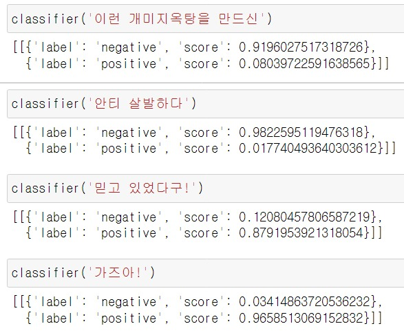

# ANT_MIND

## 네이버 종목토론실 댓글 감성(공포/탐욕) 분석

## 0. 목차 

1. 개요 및 플로우 차트
   - 개요
   - 플로우차트
2. 굿

## 1. 개요 및 플로우 차트

- #### 개요
   개미 투자자들의 감정을 분석하기 위해서 그들의 감정이 제일 잘 들어나는 네이버 종목토론실의 댓글을 분석 및 학습한다. 최종적으로 이러한 모델로 이용자의 희망 주식종목의 당일 댓글을 분석하여 공포/탐욕지수를 시각화 하는 것이 목표이다.

  

   감성분석은 크게 두가지로 분류될 수 있다. 첫번째는 어휘 기반 분석, 두번째는 머신 러닝 분석이다.  이번 프로젝트에서 사용하는 비정형 데이터인 네이버 금융 종목토론실 댓글의 감정(공포/탐욕) 분석을 진행할 예정이다.하지만 이러한 데이터에는 현재 공포/탐욕 레이블링이 되어있는 학습데이터가 존재하지 않다. 그렇기 때문에 머신 러닝 분석에서 비지도 학습을 진행하거나, 어휘 기반 분석을 진행해야만 한다. 나는 지도 학습으로 분석을 하고 싶기 때문에, 내가 직접 공포/탐욕 단어 메뉴얼을 만들어서 어휘 기반 분석을 진행해서 학습데이터를 생성한 뒤, 그 데이터로 지도 학습을 진행할 계획이다. 지도학습은 최근 성능이 좋다고 유명한 BERT모델을 이용해서 학습할 계획이다.

- #### 플로우차트

## 2. 댓글 크롤링 및 공포/탐욕 레이블링

- #### 네이버 종목토론실 댓글 크롤링 

  희망하는 종목과 페이지갯수(페이지당 댓글 20개)를 입력하면 크롤링 하는 함수를 실행 및 csv로 저장

  

- #### 댓글 전처리

  크롤링한 카카오댓글과 삼성전자댓글 데이터를 불러옵니다.

  ```python
  df_ka = pd.read_csv('./src/comments_kakao_300000.csv')
  df_sam = pd.read_csv('./src/comments_samsung_200000.csv')
  df = df_ka.append(df_sam)
  df = df.reset_index(drop=True)
  print('데이터 크기: ',df.shape)
  # 데이터 크기:  (500000, 5)
  ```

  

  크롤링때 발생한 error와 결측치를 제거합니다.

  ```python
  df = df[df['댓글'] != 'error']
  df = df.dropna()
  print('데이터 크기: ',df.shape)
  # 데이터 크기:  (499984, 5)
  ```

  정규표현식을 통해 댓글을 정제하고, 공백으로 남은 댓글을 제거합니다. 필요한 컬럼만 남깁니다.

  ```python
  df['정제된 댓글'] = df['댓글'].str.replace('\[삭제된 게시물의 답글\]',' ')
  df['정제된 댓글'] = df['정제된 댓글'].str.replace('답글:',' ')
  df['정제된 댓글'] = df['정제된 댓글'].str.replace('[^가-힣]',' ').str.replace(' +',' ').str.strip()
  df = df[df['정제된 댓글'] != '']
  df = df.reset_index(drop=True)
  df = df[['댓글','정제된 댓글']]
  print('데이터 크기: ',df.shape)
  # 데이터 크기:  (493864, 2)
  ```

  

  KoNLPy를 이용해서 정제된 댓글을 형태소분리를 진행합니다.

  ```python
  from konlpy.tag import Okt
  
  okt = Okt()
  tag_list = ['Noun','Verb','Adjective','VerbPrefix']
  tokenized_data = []
  for i in range(df.shape[0]):
      tokenized_sentence = okt.pos(df['정제된 댓글'][i], stem=True)
      tag_checked_sentence = []
      for j in tokenized_sentence:
          x,y = j
          if y in tag_list:
              tag_checked_sentence.append(x)
      tokenized_data.append(tag_checked_sentence)
      print(f'\r{i+1}개 형태소분석 완료.',end='')
  df['토큰화 댓글'] = tokenized_data
  df = df.reset_index(drop=True)
  df = df[df['토큰화 댓글'] != '[]']
  print('\n데이터 크기: ',df.shape)
  # 493864개 형태소분석 완료.
  # 데이터 크기:  (493864, 3)
  ```

  토큰화 댓글을 기준으로 중복된 댓글을 제거합니다.

  ```python
  df = df.drop_duplicates('토큰화 댓글')
  df = df.reset_index(drop=True)
  print('\n데이터 크기: ',df.shape)
  # 데이터 크기:  (362544, 3)
  ```

  

- #### 공포/탐욕 단어 메뉴얼 지정

  주식과 관련된 단어중 공포/탐욕으로 분류할 수 있는 단어를 내가 직접 판단해서 메뉴얼을 제작했다.

  ```python
  greed_word = ['매수','사','사다','사라','사면','사고','줍다','들어오다','들어가다','타다','수급','매집','올라타다','탑승','불나방','담다','오르다','올라가다','올리다','올려주다','올린다','오름','올려놓다','오른','상향','양봉','상방','상승','살아나다','양전','상한','반등','폭등','퍽등','급등','탐욕','찬티','좋다','간다','가다','가즈','싸다','익절','제발','최고','돌파','수익','위대하다','먹다','기회','호재','감사','감사하다','대박','대단하다','승리','찬양','믿다','회복','갓','부활','영차','개꿀']
  fear_word = ['공매도','공매','매도','팔','파다','팔다','팔고','팔면','던지다','털다','탈출','튀다','튀어','설거지','손절','버리다','떨어지다','떨구다','빠지다','하락','폭락','떡락','반토막','내리다','내려오다','깨지다','대퍽락','나락','붕괴','추락','공포','안티','망하다','물리다','끝나다','손해','폭망','거품','무섭다','자살','악재','상폐','개미지옥' ,'시발','염병','욕','짜증나다','걸레','어휴','개','놈','아가리','빡치다','지랄','손실','버티다','존버','개관','주가조작','쓰레기','죽다','패닉','홀딩','바닥','흑우','추매','추미애']
  ```

- #### 공포/탐욕 레이블링

  토큰화 된 댓글에 탐욕단어 한개당 +1점, 공포단어 한개당 -1점을 부여하고 점수가 양수이면 탐욕 음수이면 공포라고 판단한다. 공포는 0, 탐욕은 1, 알수없으면 m으로 레이블링을 진행한다.

  ```python
  df['공포탐욕'] = 0
  label_list = df['공포탐욕'].to_list()
  token_list = df['토큰화 댓글'].to_list()
  for i in range(len(token_list)):
      x = eval(token_list[i])
      for word in x:
          if word in greed_word:
              label_list[i] += 1
          if word in fear_word:
              label_list[i] -= 1
      if label_list[i] == 0:
          label_list[i] = 'm'
      elif label_list[i] > 0:
          label_list[i] = 1
      elif label_list[i] < 0:
          label_list[i] = 0
      print(f'\r{i+1}개 라벨링 완료.',end='')
  df['공포탐욕'] = label_list
  print('데이터 크기: ',df.shape)
  # 데이터 크기:  (362544, 4)
  ```

  

## 3. 지도 학습 분석 - LSTM

- 코랩에서 세팅


## 4. 사전 학습 모델 - BERT 

원래는 BERT 모델을 사용해서 종목토론실 댓글에 맞게 모델을 미세조정(Fine-Tuning)을 진행하려 했으나, 코랩에서 수 많은 에러 및 구동제한, 학습에 걸리는 굉장히 긴 시간, 그렇게 학습시킨 모델의 처참하게 좋지 않은 성능으로 인해서 포기하게 되었다. 그 대신, [Hugging Face](https://huggingface.co/)를 이용해서 사전에 미세조정이 완료된 모델중 네이버 종목토론실 댓글의 감성분석에 맞는 모델을 찾아서 분석하기로 결정했다.

- BERT 미세조정 모델 ([sangrimlee/bert-base-multilingual-cased-nsmc](https://huggingface.co/sangrimlee/bert-base-multilingual-cased-nsmc))

  ```python
  from transformers import pipeline
  # 모델 불러오기
  classifier = pipeline("sentiment-analysis", 
      model="sangrimlee/bert-base-multilingual-cased-nsmc")
  # 모델 저장
  classifier.save_pretrained('./src/bert')
  ```

- 저장된 모델 불러오기

  ```python
  from transformers import TextClassificationPipeline
  from transformers import BertTokenizerFast
  from transformers import TFBertForSequenceClassification
  # 토크나이저 와 모델 불러오기
  loaded_tokenizer = BertTokenizerFast.from_pretrained('./src/bert',from_pt=True)
  loaded_model = TFBertForSequenceClassification.from_pretrained('./src/bert',
                                                                 from_pt=True)
  # 파이프라인 생성
  classifier = TextClassificationPipeline(
      tokenizer=loaded_tokenizer, 
      model=loaded_model, 
      framework='tf',
      return_all_scores=True)
  ```

- 모델 적용 예시

  

# 5. 오늘의 종목토론실 댓글 공포/탐욕지수 분석


참고문헌

- [감성 분석 참고 블로그](https://yngie-c.github.io/nlp/2020/07/31/sentiment_analysis/)

- [감성사전에 기반한 준지도학습 감성분석 모델](https://realblack0.github.io/portfolio/pmi)

- [준지도 학습을 이용한 감성분석](https://github.com/realblack0/semi-supervised-sentiment-analysis/blob/master/sample/(sample)형태소 분석.ipynb)

- [SKTbrain팀 KoBERT 실습사례 네이버 영화리뷰 감성분석](https://github.com/SKTBrain/KoBERT/blob/master/scripts/NSMC/naver_review_classifications_pytorch_kobert.ipynb)

- [BERT모델을 이용해서 금융뉴스 긍부정 분석](https://github.com/ukairia777/finance_sentiment_corpus/blob/main/BERT_sentiment_analysis_kor.ipynb)

  

